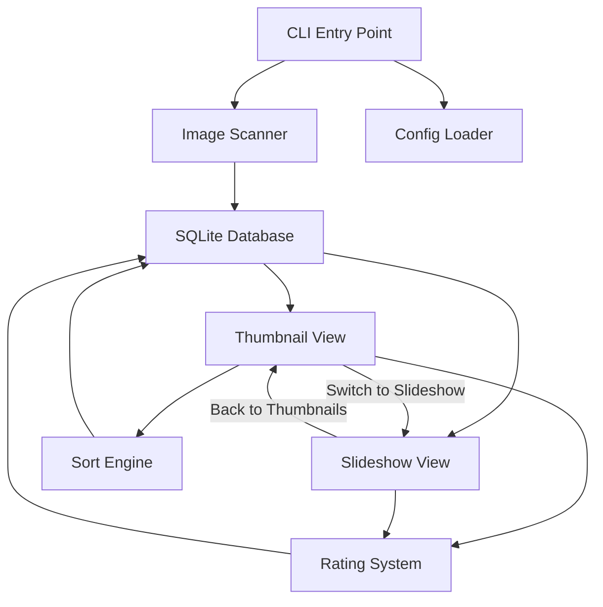
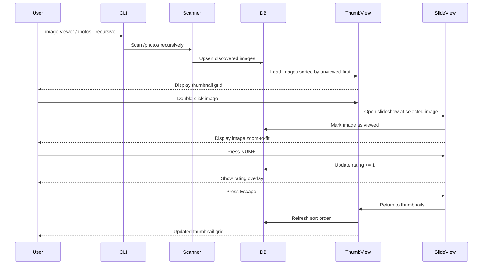

# Image Viewer — Architecture Plan

## Overview

A lightweight image viewer inspired by feh, built with **Python 3 + GTK 4** (via PyGObject). Features thumbnail browsing, slideshow playback, image rating, and viewed-status tracking with an SQLite backend.

## Technology Stack

| Component | Choice | Rationale |
|-----------|--------|-----------|
| Language | Python 3.10+ | Fast development, good ecosystem |
| GUI | GTK 4 via PyGObject | Lighter than Qt, native Linux feel |
| Image loading | Pillow (PIL) + GdkPixbuf | Pillow for metadata, GdkPixbuf for GTK display |
| Database | SQLite 3 (stdlib) | Zero-dependency, single-file persistence |
| CLI | argparse (stdlib) | No extra dependencies |
| Config | TOML (stdlib in 3.11+) | Human-readable defaults |

## Supported Image Formats

JPEG, PNG, GIF, BMP, WebP — detected by file extension (case-insensitive): `.jpg`, `.jpeg`, `.png`, `.gif`, `.bmp`, `.webp`

---

## Architecture Diagram



## Module Structure

```
image-viewer/
├── pyproject.toml              # Project metadata and dependencies
├── README.md
├── plans/
│   └── architecture.md         # This file
└── src/
    └── image_viewer/
        ├── __init__.py
        ├── __main__.py          # Entry point - CLI parsing
        ├── app.py               # GTK Application class
        ├── config.py            # Configuration loading/defaults
        ├── database.py          # SQLite layer
        ├── scanner.py           # Directory walking, image discovery
        ├── models.py            # Data classes for ImageInfo, etc.
        ├── thumbnail_view.py    # Thumbnail grid window
        ├── slideshow_view.py    # Slideshow window
        ├── rating.py            # Rating logic and display time calc
        ├── sorting.py           # Sort strategies
        └── utils.py             # Shared utilities
```

---

## Database Schema

SQLite database stored in the base image directory as `.image-viewer.db` (e.g., `/photos/.image-viewer.db`). If the directory is not writable, falls back to `~/.config/image-viewer/<hash>.db` where `<hash>` is derived from the directory path. When multiple root paths are provided, each gets its own database; the viewer merges results in memory.

```sql
CREATE TABLE IF NOT EXISTS images (
    id INTEGER PRIMARY KEY AUTOINCREMENT,
    filepath TEXT UNIQUE NOT NULL,     -- Absolute path to image
    filename TEXT NOT NULL,            -- Just the filename
    directory TEXT NOT NULL,           -- Parent directory path
    file_size INTEGER,                 -- Bytes
    file_modified REAL,                -- mtime as Unix timestamp
    rating INTEGER DEFAULT 0,          -- 0=unrated, 1-5 stars
    viewed INTEGER DEFAULT 0,          -- 0=not viewed, 1=viewed
    view_count INTEGER DEFAULT 0,      -- Total times viewed
    last_viewed REAL,                  -- Unix timestamp
    first_seen REAL NOT NULL,          -- When first scanned
    thumbnail_cache TEXT               -- Path to cached thumbnail (optional)
);

CREATE INDEX IF NOT EXISTS idx_filepath ON images(filepath);
CREATE INDEX IF NOT EXISTS idx_directory ON images(directory);
CREATE INDEX IF NOT EXISTS idx_rating ON images(rating);
CREATE INDEX IF NOT EXISTS idx_viewed ON images(viewed);
```

---

## CLI Interface

```
image-viewer [OPTIONS] [PATH...]

Positional:
  PATH                    Directories or files to view (default: current dir)

Options:
  -r, --recursive         Recursively scan directories (default: on)
  --no-recursive          Disable recursive scanning
  -s, --slideshow         Start in slideshow mode instead of thumbnails
  --slideshow-time SECS   Base display time in seconds (default: 5.0)
  --slideshow-order ORDER Slideshow order: forward|backward|random (default: forward)
  --loop                  Loop slideshow (default: off)
  --sort SORT             Sort order: alpha|directory|unviewed|viewed|rating|rating-desc
                          (default: unviewed)
  --thumb-size SIZE       Thumbnail size in pixels (default: 200)
  --fullscreen            Start slideshow in fullscreen (default: on)
  --windowed              Start slideshow in windowed mode
  --rating-multiplier N   Display time multiplier per rating star (default: 0.5)
                          e.g., 5-star image: base_time + 5 * 0.5 = base + 2.5s
  -h, --help              Show help
  --version               Show version
```

**Defaults**: Thumbnail view, recursive scanning, sort by unviewed-first.

---

## Feature Details

### 1. Thumbnail View

- **Layout**: Scrollable GTK grid of thumbnail images
- **Reflow**: Thumbnails reflow when window is resized
- **Thumbnail size**: Configurable, default 200px
- **Visual indicators**:
  - Unviewed images: subtle highlight border or badge
  - Rating: star overlay or dots below thumbnail
  - Currently selected: highlighted border
- **Interaction**:
  - **Mouse**: Click to select, double-click to open in slideshow from that image
  - **Mouse hover**: Highlights image for rating
  - **Numpad navigation**: Move highlight with numpad arrows (8=up, 2=down, 4=left, 6=right)
  - **NUM +**: Increase rating of highlighted image
  - **NUM -**: Decrease rating of highlighted image
  - **Enter/Space**: Open selected image in slideshow
  - **S**: Start slideshow from current sort position
- **Sorting**: Dropdown or keyboard shortcut to change sort order

### 2. Slideshow View

- **Display**: Single image, zoom-to-fit window
- **Zoom-to-fit behavior**: When window is resized, the new size becomes the target size for ALL subsequent images (not just the current one)
- **Modes**: Fullscreen (default) or windowed
- **Navigation**:
  - **Right arrow / Space**: Next image
  - **Left arrow / Backspace**: Previous image
  - **Escape / Q**: Return to thumbnail view
  - **F**: Toggle fullscreen
- **Slideshow playback**:
  - **P**: Play/pause auto-advance
  - Direction: forward, backward, random
  - Loop: when reaching end, wrap around (if enabled)
  - Auto-advance timer: `base_time + (rating * rating_multiplier)` seconds
- **Rating in slideshow**:
  - **NUM +**: Increase rating of current image
  - **NUM -**: Decrease rating of current image
  - Rating change shown as brief overlay notification
- **Viewed tracking**: Image marked as viewed when displayed for at least 1 second

### 3. Rating System

- Scale: 0 (unrated) to 5 stars
- Persisted to SQLite immediately on change
- Affects slideshow display time: `display_time = base_time + rating * multiplier`
  - Example: base=5s, multiplier=0.5s → 5-star image shows for 7.5s
- Can be used as sort criteria in thumbnail view

### 4. Sort Options

| Sort Key | Description |
|----------|-------------|
| `alpha` | Alphabetical by filename |
| `directory` | Grouped by parent directory, then alphabetical |
| `unviewed` | Unviewed images first, then by filename |
| `viewed` | Viewed images first, then by filename |
| `rating` | Lowest rating first (unrated at top) |
| `rating-desc` | Highest rating first |

### 5. Viewed Tracking

- An image is marked as "viewed" when displayed in slideshow for ≥1 second
- View count incremented each time
- Last viewed timestamp updated
- In thumbnail view: unviewed images have a distinct visual indicator (e.g., blue dot or border)

### 6. Configuration

Stored at `~/.config/image-viewer/config.toml`:

```toml
[defaults]
recursive = true
sort = "unviewed"
thumbnail_size = 200
slideshow_time = 5.0
slideshow_order = "forward"
loop = false
fullscreen = true
rating_multiplier = 0.5

[appearance]
highlight_color = "#4a90d9"
unviewed_indicator = "border"  # "border", "dot", or "none"
```

CLI arguments override config file values.

---

## Key Design Decisions

1. **GTK 4 over GTK 3**: GTK 4 is the current stable version with better performance and modern API. If GTK 4 PyGObject is not available, we can fall back to GTK 3.
2. **SQLite in image directory**: Database stored as `.image-viewer.db` in the base image directory for portability — ratings and viewed status travel with the image collection. Falls back to `~/.config/image-viewer/<path-hash>.db` if the directory is read-only. When multiple root paths are specified, each gets its own DB; results are merged in memory.
3. **Thumbnail caching**: Generate thumbnails on first scan and cache them to `~/.cache/image-viewer/` for fast loading.
4. **Lazy loading**: Only load visible thumbnails in the grid to handle large directories.
5. **Zoom-to-fit with sticky size**: The slideshow remembers the window size after any resize and applies it to all subsequent images, maintaining consistent framing.

---

## Data Flow



---

## Dependencies

```
# pyproject.toml dependencies
PyGObject >= 3.42
Pillow >= 9.0
```

System packages needed (Arch/Ubuntu):
- `gtk4` / `libgtk-4-dev`
- `python-gobject` / `python3-gi`
- `gir1.2-gtk-4.0` (Ubuntu)

---

## Implementation Order

1. Project scaffolding (pyproject.toml, package structure)
2. Database layer (models, CRUD operations)
3. Image scanner (directory walking, DB upsert)
4. CLI parser
5. GTK Application shell (window management, mode switching)
6. Thumbnail view (grid, display, scrolling)
7. Slideshow view (image display, zoom-to-fit, navigation)
8. Rating system (keyboard handling, DB updates, overlays)
9. Sorting engine (all sort strategies)
10. Viewed tracking (auto-mark, indicators)
11. Slideshow auto-advance with rating-based timing
12. Configuration file support
13. Thumbnail caching
14. Polish (error handling, edge cases, keyboard shortcuts help)
